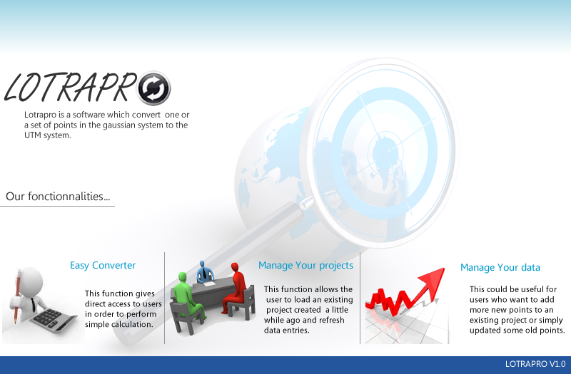

# LOTRAPRO
Software to assist in the transformation of geographical coordinates in the cadastral field for better management, monitoring and control of land ownership. It allows the conversion of one or more points in the Gaussian system to the UTM system

